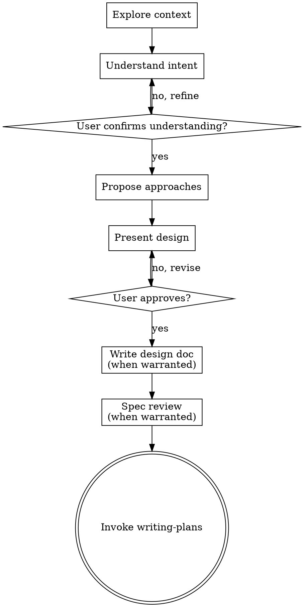

# Brainstorming Ideas Into Designs

Turn ideas into designs through collaborative dialogue. Scale your effort to the task — a link in a header needs a different process than a new subsystem — but always confirm you understand what the user wants before you build anything.

<HARD-GATE>
Do NOT invoke any implementation skill, write any code, scaffold any project, or take any implementation action until:
1. You have stated your understanding of the user's intent
2. The user has confirmed that understanding

This applies to every task regardless of size. The confirmation can be brief ("I'll add a GitHub icon-link to the header, styled to match the existing theme — sound right?"), but you must get it.
</HARD-GATE>

## Anti-Pattern: Skipping Understanding

The failure mode is not "too little ceremony." It is jumping to implementation with unchecked assumptions. Simple tasks are where this happens most — you assume you know what the user wants and start editing. Even when you're right about the *what*, you miss preferences about the *how*.

## The Process

Scale every step to the task at hand. The process is the same whether the task takes five minutes or five days — but the depth changes.

Create tasks to track the steps you'll execute. For a small change, that might be steps 1–3 only. For a large project, all eight.

### 1. Explore project context

Check files, docs, recent commits. For a small change, glance at the relevant file. For a new system, explore broadly.

### 2. Understand user intent

- Ask questions one at a time to refine the idea
- Prefer multiple choice when possible, but open-ended is fine too
- Focus on purpose, constraints, and success criteria
- Before detailed questions, assess scope: if the request spans multiple independent subsystems, flag that first. Help decompose before refining details.
- If the project is too large for a single spec, help the user break it into sub-projects. Each sub-project gets its own brainstorm → plan → implementation cycle.

### 3. Confirm understanding

State what you believe the user wants. Get explicit confirmation before proceeding. This is the hard gate — everything after this step is optional depending on scope.

### 4. Propose approaches

- Propose 2-3 approaches with trade-offs
- Lead with your recommendation and explain why
- For straightforward tasks where you see only one reasonable approach, say so — but give the user a chance to disagree

### 5. Present design and get approval

- Scale each section to its complexity
- Ask after each section whether it looks right
- Cover what matters: architecture, components, data flow, error handling, testing — skip sections that don't apply
- Go back and revise when something doesn't fit

### 6. Write design doc (when warranted)

- Save to `docs/superpowers/specs/YYYY-MM-DD-<topic>-design.md`
  - (User preferences for spec location override this default)
- Use elements-of-style:writing-clearly-and-concisely skill if available
- Commit to git

### 7. Spec review (when warranted)

1. Dispatch spec-document-reviewer subagent (see spec-document-reviewer-prompt.md)
2. If issues found: fix, re-dispatch, repeat until approved
3. If the loop exceeds 5 iterations, surface to human

### 8. Transition to implementation

- Invoke the writing-plans skill to create an implementation plan
- Do NOT invoke frontend-design, mcp-builder, or any other implementation skill. The ONLY skill you invoke after brainstorming is writing-plans.

### Skipping steps

Steps 1–3 always happen. Steps 4–7 scale to the task.

When you believe a step is unnecessary, **ask the user for permission to skip it.** Do not skip silently. For example:

> "This is straightforward enough that I don't think we need a design doc or spec review — I'll propose a quick approach and we can go from there. Sound good?"

The user may agree, or they may want the full process. Either way, they decide.

## Process Flow

## Design Guidance

**Design for isolation and clarity:**
- Break the system into units with one clear purpose, well-defined interfaces, and independent testability
- For each unit, answer: what does it do, how do you use it, what does it depend on?
- If you can't understand a unit without reading its internals, or change its internals without breaking consumers, the boundaries need work
- Smaller units are easier to reason about and edit reliably. A file that keeps growing is doing too much.

**Working in existing codebases:**
- Explore the current structure before proposing changes. Follow existing patterns.
- Where existing code has problems that affect the work, include targeted improvements in the design
- Stay focused on what serves the current goal. Don't propose unrelated refactoring.

## Key Principles

- **One question at a time** — don't overwhelm with multiple questions
- **Multiple choice preferred** — easier to answer than open-ended when possible
- **YAGNI ruthlessly** — remove unnecessary features from all designs
- **Explore alternatives** — propose approaches before settling
- **Incremental validation** — present, get approval, then move on
- **Be flexible** — go back and clarify when something doesn't make sense

## Visual Companion (Claude Code Only)

A browser-based visual companion for showing mockups, diagrams, and options during brainstorming. Use it whenever visual representation would make feedback easier than text descriptions alone.

**When the topic involves visual decisions, ask:**
> "This involves some visual decisions. I can show mockups in a browser window so you can see options and give feedback visually. This feature is still new — it can be token-intensive and a bit slow, but it works well for layout, design, and architecture questions. Want to try it? (Requires opening a local URL)"

If they agree, read the detailed guide before proceeding:
`${CLAUDE_PLUGIN_ROOT}/skills/brainstorming/visual-companion.md`
