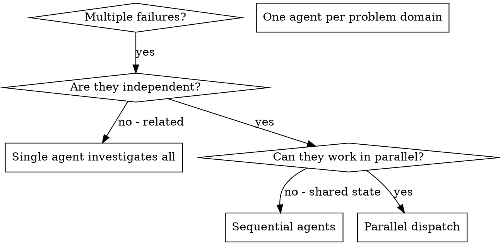

# Dispatching Parallel Agents

## Overview

You delegate tasks to specialized agents with isolated context. By precisely crafting their instructions and context, you ensure they stay focused and succeed at their task. They should never inherit your session's context or history — you construct exactly what they need. This also preserves your own context for coordination work.

When you have multiple tasks, running them sequentially wastes time. Choose the right parallelization strategy based on how much coordination the tasks need.

**Core principle:** Match the coordination mechanism to the task dependencies.

## Three Tiers of Parallelization

| Tier | Mechanism | Coordination | Best for |
|------|-----------|-------------|----------|
| **Parallel dispatch** | Multiple Agent calls | None — fire and wait | Independent tasks, no shared state |
| **Subagent relay** | Fresh agent per task, you relay | You pass context between | Light dependencies, assembly-line |
| **Team mode** | TeamCreate + persistent agents | Agents message each other directly | Interdependent work, review loops, shared contracts |

### Decision heuristic:
```
Are tasks independent?
  Yes → Parallel dispatch (simple, fast)
  No → Do agents need to talk to EACH OTHER?
    No  → Subagent relay (you pass context)
    Yes → Team mode (agents coordinate directly)
```

## Available Agent Types

### Research Agents

| Agent | subagent_type | When to dispatch |
|-------|---------------|-----------------|
| **Explore** | `Explore` | Fast codebase search — "where does X live?", file patterns, keyword search. Use as first research step |
| **code-explorer** | `feature-dev:code-explorer` | Deep analysis — "how does X work?" Traces execution paths, maps architecture. Use when Explore isn't enough |
| **Plan** | `Plan` | Strategy and sequencing — "what's the approach?" Trade-offs, step ordering, risks. Use before code-architect |

### Design Agents

| Agent | subagent_type | When to dispatch |
|-------|---------------|-----------------|
| **code-architect** | `feature-dev:code-architect` | Implementation blueprint — analyzes existing patterns, produces files/components/data flow. Pair with Plan output |

### Quality Agents (post-write — dispatch after ANY code is written)

| Agent | subagent_type | When to dispatch |
|-------|---------------|-----------------|
| **code-reviewer** (bugs) | `feature-dev:code-reviewer` | Reviews for bugs, security issues, convention violations. Confidence >=80 only |
| **code-reviewer** (plan) | `superpowers:code-reviewer` | Reviews implementation against the original plan for alignment |
| **code-simplifier** | `code-simplifier:code-simplifier` | After code-reviewer passes — refactors for clarity without changing behavior |

### Skills as Agent Context

The **frontend-design** skill (`frontend-design:frontend-design`) is not a dispatchable agent, but reference it when prompting agents working on UI — during brainstorming, plan execution, or team mode.

### Standard Pipeline

```
Explore → code-explorer → Plan → code-architect → [implement] → code-reviewer → code-simplifier
```

- **Explore first** — fast search to orient before deep analysis
- **code-explorer before code-architect** — understand what exists before designing what's new
- **Plan before code-architect** — strategy before blueprint for non-trivial features
- **code-reviewer after ANY code is written** — every implementation step, not just debugging
- **code-simplifier after code-reviewer passes** — only simplify working, reviewed code
- Agents are **read-only** (except code-simplifier)
- Dispatch independent agents in parallel via multiple Agent tool calls in one message

## When to Use



**Use when:**
- 3+ test files failing with different root causes
- Multiple subsystems broken independently
- Each problem can be understood without context from others
- No shared state between investigations

**Don't use when:**
- Failures are related (fix one might fix others)
- Need to understand full system state
- Agents would interfere with each other

## The Pattern

### 1. Identify Independent Domains

Group failures by what's broken:
- File A tests: Tool approval flow
- File B tests: Batch completion behavior
- File C tests: Abort functionality

Each domain is independent - fixing tool approval doesn't affect abort tests.

### 2. Create Focused Agent Tasks

Each agent gets:
- **Specific scope:** One test file or subsystem
- **Clear goal:** Make these tests pass
- **Constraints:** Don't change other code
- **Expected output:** Summary of what you found and fixed

### 3. Dispatch in Parallel

Issue all three subagent dispatches in the same response — they run in parallel:

```text
Subagent (general-purpose): "Fix agent-tool-abort.test.ts failures"
Subagent (general-purpose): "Fix batch-completion-behavior.test.ts failures"
Subagent (general-purpose): "Fix tool-approval-race-conditions.test.ts failures"
# All three run concurrently.
```

Multiple dispatch calls in one response = parallel execution. One per response = sequential.

### 4. Review and Integrate

When agents return:
- Read each summary
- Verify fixes don't conflict
- Run full test suite
- Integrate all changes

## Agent Prompt Structure

Good agent prompts are:
1. **Focused** - One clear problem domain
2. **Self-contained** - All context needed to understand the problem
3. **Specific about output** - What should the agent return?

```markdown
Fix the 3 failing tests in src/agents/agent-tool-abort.test.ts:

1. "should abort tool with partial output capture" - expects 'interrupted at' in message
2. "should handle mixed completed and aborted tools" - fast tool aborted instead of completed
3. "should properly track pendingToolCount" - expects 3 results but gets 0

These are timing/race condition issues. Your task:

1. Read the test file and understand what each test verifies
2. Identify root cause - timing issues or actual bugs?
3. Fix by:
   - Replacing arbitrary timeouts with event-based waiting
   - Fixing bugs in abort implementation if found
   - Adjusting test expectations if testing changed behavior

Do NOT just increase timeouts - find the real issue.

Return: Summary of what you found and what you fixed.
```

## Common Mistakes

**❌ Too broad:** "Fix all the tests" - agent gets lost
**✅ Specific:** "Fix agent-tool-abort.test.ts" - focused scope

**❌ No context:** "Fix the race condition" - agent doesn't know where
**✅ Context:** Paste the error messages and test names

**❌ No constraints:** Agent might refactor everything
**✅ Constraints:** "Do NOT change production code" or "Fix tests only"

**❌ Vague output:** "Fix it" - you don't know what changed
**✅ Specific:** "Return summary of root cause and changes"

## When NOT to Use

**Related failures:** Fixing one might fix others - investigate together first
**Need full context:** Understanding requires seeing entire system
**Exploratory debugging:** You don't know what's broken yet
**Shared state:** Agents would interfere (editing same files, using same resources)

## After Agents Return

1. **Review each summary** — understand what changed
2. **Check for conflicts** — did agents edit same code?
3. **Run full suite** — verify all fixes work together
4. **Spot check** — agents can make systematic errors

## Team Mode (Tier 3)

When tasks are **interdependent** and agents need to coordinate directly, use team mode.

### When to Use Team Mode
- 3+ tasks where agent output feeds into another agent's work
- Review-fix loops (reviewer finds issue → implementer fixes → re-review)
- Multiple agents working on shared contracts (frontend + backend agreeing on API shape)
- Full-stack features where changes need to stay synchronized

### Team Setup
```
TeamCreate → define team purpose
TaskCreate → add tasks from plan
Agent(team_name, name) → spawn teammates
TaskUpdate(owner) → assign tasks
SendMessage → coordinate between agents
```

### Example: Full-Stack Feature Team
```
Lead (you) → creates tasks, reviews progress, resolves conflicts
├── backend-dev (general-purpose) — API endpoints, data layer
├── frontend-dev (general-purpose) — UI components, state
├── reviewer (general-purpose, prompted with skills/requesting-code-review/code-reviewer.md) — reviews both, flags contract mismatches
└── simplifier (code-simplifier) — cleans up after reviews pass
```

Backend and frontend can message each other about types/API shape. Reviewer watches both and catches drift.

### Example: Debug Investigation Team
```
Lead (you) → synthesizes findings, decides fix approach
├── explorer-happy (Explore) — traces the working path
├── explorer-error (Explore) — traces the failing path
└── reviewer (general-purpose, prompted with skills/requesting-code-review/code-reviewer.md) — cross-references both findings
```

### Team Mode Rules
- Always assign a clear scope to each teammate
- Use TaskCreate for all work items so progress is visible
- Teammates communicate via SendMessage, not through you (that's the whole point)
- Shut down teammates when done: SendMessage with type "shutdown_request"
- Clean up with TeamDelete after all agents are done
