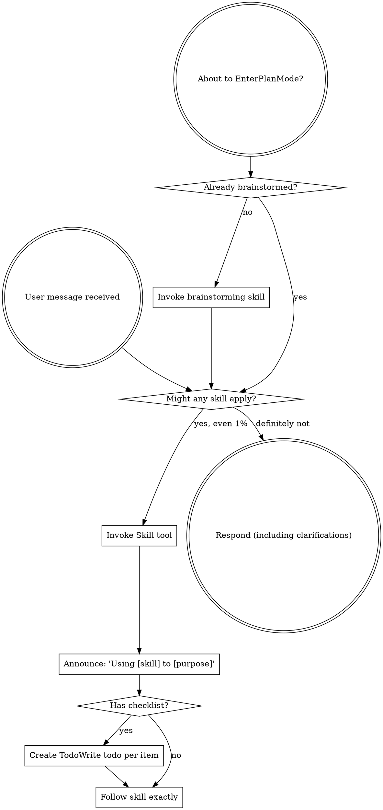

**Superpowers fork: dxl0632 (custom)**

<EXTREMELY-IMPORTANT>
If you think there is even a 1% chance a skill might apply to what you are doing, you ABSOLUTELY MUST invoke the skill.

IF A SKILL APPLIES TO YOUR TASK, YOU DO NOT HAVE A CHOICE. YOU MUST USE IT.

This is not negotiable. This is not optional. You cannot rationalize your way out of this.
</EXTREMELY-IMPORTANT>

## Instruction Priority

Superpowers skills override default system prompt behavior, but **user instructions always take precedence**:

1. **User's explicit instructions** (CLAUDE.md, direct requests) — highest priority
2. **Superpowers skills** — override default system behavior where they conflict
3. **Default system prompt** — lowest priority

If CLAUDE.md says "don't use TDD" and a skill says "always use TDD," follow the user's instructions.

## How to Access Skills

**In Claude Code:** Use the `Skill` tool. When you invoke a skill, its content is loaded and presented to you—follow it directly. Never use the Read tool on skill files.

**In other environments:** Check your platform's documentation for how skills are loaded.

# Using Skills

## The Rule

**Invoke relevant or requested skills BEFORE any response or action.** Even a 1% chance a skill might apply means that you should invoke the skill to check. If an invoked skill turns out to be wrong for the situation, you don't need to use it.


```dot
digraph skill_flow {
    "User message received" [shape=doublecircle];
    "About to EnterPlanMode?" [shape=doublecircle];
    "Already brainstormed?" [shape=diamond];
    "Invoke brainstorming skill" [shape=box];
    "Might any skill apply?" [shape=diamond];
    "Invoke Skill tool" [shape=box];
    "Announce: 'Using [skill] to [purpose]'" [shape=box];
    "Has checklist?" [shape=diamond];
    "Create TodoWrite todo per item" [shape=box];
    "Follow skill exactly" [shape=box];
    "Respond (including clarifications)" [shape=doublecircle];

    "About to EnterPlanMode?" -> "Already brainstormed?";
    "Already brainstormed?" -> "Invoke brainstorming skill" [label="no"];
    "Already brainstormed?" -> "Might any skill apply?" [label="yes"];
    "Invoke brainstorming skill" -> "Might any skill apply?";

    "User message received" -> "Might any skill apply?";
    "Might any skill apply?" -> "Invoke Skill tool" [label="yes, even 1%"];
    "Might any skill apply?" -> "Respond (including clarifications)" [label="definitely not"];
    "Invoke Skill tool" -> "Announce: 'Using [skill] to [purpose]'";
    "Announce: 'Using [skill] to [purpose]'" -> "Has checklist?";
    "Has checklist?" -> "Create TodoWrite todo per item" [label="yes"];
    "Has checklist?" -> "Follow skill exactly" [label="no"];
    "Create TodoWrite todo per item" -> "Follow skill exactly";
}
```

## Red Flags

These thoughts mean STOP—you're rationalizing:

| Thought | Reality |
|---------|---------|
| "This is just a simple question" | Questions are tasks. Check for skills. |
| "I need more context first" | Skill check comes BEFORE clarifying questions. |
| "Let me explore the codebase first" | Skills tell you HOW to explore. Check first. |
| "I can check git/files quickly" | Files lack conversation context. Check for skills. |
| "Let me gather information first" | Skills tell you HOW to gather information. |
| "This doesn't need a formal skill" | If a skill exists, use it. |
| "I remember this skill" | Skills evolve. Read current version. |
| "This doesn't count as a task" | Action = task. Check for skills. |
| "The skill is overkill" | Simple things become complex. Use it. |
| "I'll just do this one thing first" | Check BEFORE doing anything. |
| "This feels productive" | Undisciplined action wastes time. Skills prevent this. |
| "I know what that means" | Knowing the concept ≠ using the skill. Invoke it. |

## Skill Priority

When multiple skills could apply, use this order:

1. **Process skills first** (brainstorming, debugging) - these determine HOW to approach the task
2. **Implementation skills second** (frontend-design, mcp-builder) - these guide execution

"Let's build X" → brainstorming first, then implementation skills.
"Fix this bug" → debugging first, then domain-specific skills.

## Skill Types

**Rigid** (TDD, debugging): Follow exactly. Don't adapt away discipline.

**Flexible** (patterns): Adapt principles to context.

The skill itself tells you which.

## Available Agents

In addition to skills, you have specialized **agents** you can dispatch via the Agent tool. Agents run as separate processes with their own context — use them for focused work that shouldn't clutter the main conversation.

**When to use agents vs doing it yourself:** Dispatch an agent when the task is self-contained (clear input, clear output) and doesn't require back-and-forth with the user. Do the work yourself when it requires conversation or iterative decisions.

### Research Agents

| Agent | subagent_type | When to dispatch |
|-------|---------------|-----------------|
| **Explore** | `Explore` | Fast codebase search — "where does X live?", file patterns, keyword search. Use as first research step before deeper analysis |
| **code-explorer** | `feature-dev:code-explorer` | Deep analysis — "how does X work?" Traces execution paths, maps architecture, documents dependencies. Use when Explore isn't enough |
| **Plan** | `Plan` | Strategy and sequencing — "what's the approach?" Identifies trade-offs, step ordering, risks. Use before code-architect for non-trivial features |

### Design Agents

| Agent | subagent_type | When to dispatch |
|-------|---------------|-----------------|
| **code-architect** | `feature-dev:code-architect` | Implementation blueprint — analyzes existing patterns, produces specific files/components/data flow. Pair with Plan agent output |

### Quality Agents (post-write — dispatch after ANY code is written)

| Agent | subagent_type | When to dispatch |
|-------|---------------|-----------------|
| **code-reviewer** (bugs) | `feature-dev:code-reviewer` | After writing code — reviews for bugs, security issues, convention violations. Confidence scoring, only reports issues >=80 |
| **code-reviewer** (plan) | `superpowers:code-reviewer` | After completing a plan step — reviews implementation against the original plan for alignment |
| **code-simplifier** | `code-simplifier:code-simplifier` | After code-reviewer passes — refactors recently-changed code for clarity and consistency without changing behavior |

### Skills as Agent Context

The **frontend-design** skill (`frontend-design:frontend-design`) is not a dispatchable agent, but can be referenced when building teams or prompting agents working on UI:
- During **brainstorming**: invoke `frontend-design:frontend-design` when the feature involves UI to guide design thinking (tone, aesthetics, differentiation)
- During **plan execution**: include "Invoke `frontend-design:frontend-design` skill before implementing this step" in plan tasks that involve UI work
- During **team mode**: bake frontend-design guidance into UI-focused teammate prompts

### Agent Dispatch Rules

**Standard pipeline:**
```
Explore → code-explorer → Plan → code-architect → [implement] → code-reviewer → code-simplifier
```

- **Explore first** — fast search to orient before deep analysis
- **code-explorer before code-architect** — understand what exists before designing what's new
- **Plan before code-architect** — strategy before blueprint for non-trivial features
- **code-reviewer after ANY code is written** — not just debugging, every implementation step
- **code-simplifier after code-reviewer passes** — only simplify working, reviewed code
- Agents are **read-only** (except code-simplifier) — they analyze and advise but don't modify code
- Dispatch multiple independent agents in parallel via multiple Agent tool calls in one message

### Team Mode

For complex, interdependent work where agents need to coordinate, use **team mode** (`TeamCreate`) instead of simple parallel dispatch.

**When to use team mode:**
- 3+ interdependent tasks (agents need each other's output)
- Work requiring review-fix loops (reviewer finds issue → implementer fixes → re-review)
- Multiple agents coordinating on shared contracts (e.g., frontend + backend agreeing on API shape)

**When NOT to use team mode:**
- Tasks are fully independent → use parallel agent dispatch instead
- Single-threaded work → do it yourself or use subagent-driven-development

**Decision heuristic:** See `superpowers:dispatching-parallel-agents` for the full three-tier model (parallel dispatch → subagent relay → team mode).

**Example team compositions:**

Feature build team:
```
Lead (you) → creates tasks, reviews progress
├── explorer    — maps relevant subsystems (Explore or code-explorer)
├── architect   — designs blueprint (code-architect, after explorer reports)
├── implementer — writes code (general-purpose agent)
├── reviewer    — reviews each piece as written (code-reviewer)
└── simplifier  — cleans up after review passes (code-simplifier)
```

Full-stack team:
```
Lead (you)
├── backend-dev   — API, data layer (general-purpose)
├── frontend-dev  — UI, components (general-purpose, with frontend-design guidance)
└── reviewer      — reviews both, flags contract mismatches (code-reviewer)
```

## User Instructions

Instructions say WHAT, not HOW. "Add X" or "Fix Y" doesn't mean skip workflows.
