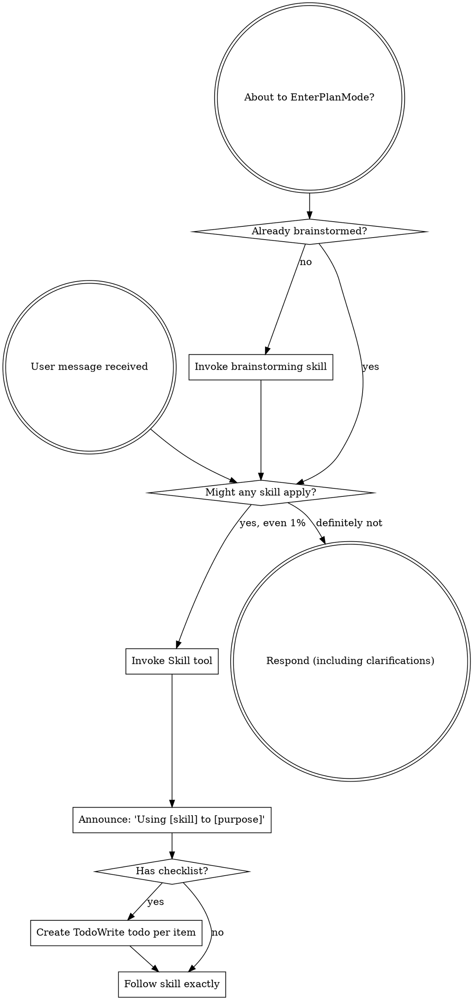

<EXTREMELY-IMPORTANT>
If you think there is even a 1% chance a skill might apply to what you are doing, you ABSOLUTELY MUST invoke the skill.

IF A SKILL APPLIES TO YOUR TASK, YOU DO NOT HAVE A CHOICE. YOU MUST USE IT.

This is not negotiable. This is not optional. You cannot rationalize your way out of this.
</EXTREMELY-IMPORTANT>

## How to Access Skills

**In Claude Code:** Use the `Skill` tool. When you invoke a skill, its content is loaded and presented to you—follow it directly. Never use the Read tool on skill files.

**In other environments:** Check your platform's documentation for how skills are loaded.

# Using Skills

## The Rule

**Invoke relevant or requested skills BEFORE any response or action.** Even a 1% chance a skill might apply means that you should invoke the skill to check. If an invoked skill turns out to be wrong for the situation, you don't need to use it.

## Red Flags

These thoughts mean STOP—you're rationalizing:

| Thought | Reality |
|---------|---------|
| "This is just a simple question" | Questions are tasks. Check for skills. |
| "I need more context first" | Skill check comes BEFORE clarifying questions. |
| "Let me explore the codebase first" | Skills tell you HOW to explore. Check first. |
| "I can check git/files quickly" | Files lack conversation context. Check for skills. |
| "Let me gather information first" | Skills tell you HOW to gather information. |
| "This doesn't need a formal skill" | If a skill exists, use it. |
| "I remember this skill" | Skills evolve. Read current version. |
| "This doesn't count as a task" | Action = task. Check for skills. |
| "The skill is overkill" | Simple things become complex. Use it. |
| "I'll just do this one thing first" | Check BEFORE doing anything. |
| "This feels productive" | Undisciplined action wastes time. Skills prevent this. |
| "I know what that means" | Knowing the concept ≠ using the skill. Invoke it. |

## Skill Priority

When multiple skills could apply, use this order:

1. **Process skills first** (brainstorming, debugging) - these determine HOW to approach the task
2. **Implementation skills second** (frontend-design, mcp-builder) - these guide execution

"Let's build X" → brainstorming first, then implementation skills.
"Fix this bug" → debugging first, then domain-specific skills.

## Skill Types

**Rigid** (TDD, debugging): Follow exactly. Don't adapt away discipline.

**Flexible** (patterns): Adapt principles to context.

The skill itself tells you which.

## Available Agents

In addition to skills, you have specialized **agents** you can dispatch via the Task tool. Agents run as separate processes with their own context — use them for focused work that shouldn't clutter the main conversation.

**When to use agents vs doing it yourself:** Dispatch an agent when the task is self-contained (clear input, clear output) and doesn't require back-and-forth with the user. Do the work yourself when it requires conversation or iterative decisions.

| Agent | subagent_type | When to dispatch |
|-------|---------------|-----------------|
| **code-explorer** | `feature-dev:code-explorer` | "How does X work?" — tracing execution paths, mapping architecture, understanding a feature deeply before modifying it |
| **code-architect** | `feature-dev:code-architect` | Designing a new feature — analyzes existing patterns and produces an implementation blueprint with files, components, data flow |
| **code-reviewer** (bugs) | `feature-dev:code-reviewer` | After writing code — reviews for bugs, security issues, convention violations. Uses confidence scoring, only reports issues ≥80 |
| **code-reviewer** (plan) | `superpowers:code-reviewer` | After completing a plan step — reviews implementation against the original plan for alignment |
| **code-simplifier** | `code-simplifier:code-simplifier` | After implementation is working — refactors recently-changed code for clarity and consistency without changing behavior |

**Agent dispatch rules:**
- **code-explorer before code-architect** — understand what exists before designing what's new
- **code-reviewer after implementation** — review code after writing it, not before
- **code-simplifier last** — only simplify code that's already working and reviewed
- Agents are **read-only** (except code-simplifier) — they analyze and advise but don't modify code
- You can dispatch multiple independent agents in parallel via multiple Task tool calls in one message

## User Instructions

Instructions say WHAT, not HOW. "Add X" or "Fix Y" doesn't mean skip workflows.
